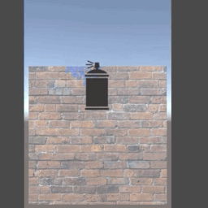

# Texture-Swapping

We have created three different styles of texture swapping.

There's 3 scenes:

1. Use a paint brush to "paint" a wall into another texture.
2. Use the same brush to paint the wall invisible.
3. Use a spray can to "paint" a wall into another texture

Please refer to our knowledge bases for more information or questions:

Documentation: https://docs.lunalabs.io/
Community forum: https://community.lunalabs.io/

